# 👋 Hi, I'm Xel

> physicist. programmer. tinkerer.

I build across the stack — smart contracts on Arbitrum Stylus, on-chain games, physics simulations, and developer tooling. I'm the founder of **Trebuchet Dynamics**, where I work on production software for AI agents, Go backends, and scientific compute.

---

## 🚀 Featured Projects

| Project | Stack | Stars |
|---------|-------|-------|
| [Arenaton](https://github.com/XelHaku/arenaton-smart-contracts) — Decentralized betting platform with parimutuel pools, NFT integration, and stablecoin mechanics | Go, Solidity | ⭐ |
| [Stylus Vault](https://github.com/XelHaku/stylus_vault) — Smart contract vault on Arbitrum Stylus | Rust | |
| [GravityPlayground](https://github.com/XelHaku/GravityPlayground) — Interactive Kepler's laws and gravitational physics simulator | C# | ⭐⭐ |
| [Onchain Loteria](https://github.com/XelHaku/onchain-loteria-nextjs) — Mexican bingo on-chain with Next.js frontend | TypeScript, Next.js, Solidity | |
| [IsJustABall](https://github.com/XelHaku/IsJustABall) — Mobile game | C# | ⭐⭐ |

---

## 🛠️ Tech Stack

**Languages:** Go · Solidity · C# · TypeScript · JavaScript · Rust · Python · Ruby
**Frameworks:** Next.js · React · Hono · Tailwind CSS
**Blockchain:** Arbitrum Stylus · Solidity · Hardhat · Foundry
**Tools:** Docker · GitHub Actions · Unity · i3wm

---

## 📊 DevCard

  

---

*📫 [arenaton.com](https://www.arenaton.com) · 🇲🇽 Mexico · ⚛️ Physics @ heart*
